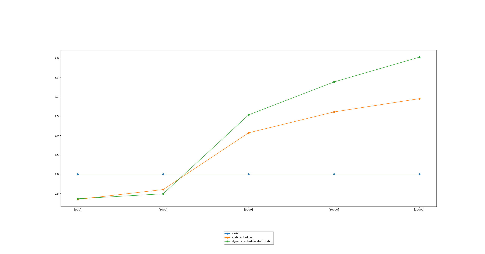

# Parallel Dijkstra с помощью OpenMP
### Окружение

* MSMPI/MPI - протестировано на MSMPI, однако Cmake должен и для других MPI работать
* python(v. 3.6.\*, 3.7.\*)
  * пакеты для python устанавливаются командой `pip install -r requirements.txt`
* cmake (3.15+)
* gcc

### Задача

Поиск минимального расстояния от вершины графа до всех остальных.
Для решения задачи используется алгоритм Дейкстры.\
Алгоритм Дейкстры:
* Выполинть `|V|-1` шагов:
    * Найти ближайшую к текущему подграф (изначально содержит начальную вершину) верншину 
    * Добавить найденную вершину в подграф
    * Срелаксировать расстояния от новой вершины до остальных
    

### Параллелизация решения

Параллелизуются 2 этапа алгоритма: нахождения ближайшей вершины, релаксация расстояний.
В рамках OpenMP это реализовано как 2 распараллеленных цикла for, с редукцией минимальной вершины. 

Для сравнения выбраны 3 типа алгоритмов: последовательный, статическое планирование, динамические планирование.

### Графики ускорения
График ускорения работы в зависимости от типа планирования и размера графа

Сравнение динамического планирования со статическим чанком и без

## Вывод
* Как и ожидалось на малых размерах графа параллелизация не дает выигрыша в скорости, однако при увеличении размера
графа разница в ускорении становится все значительней.
