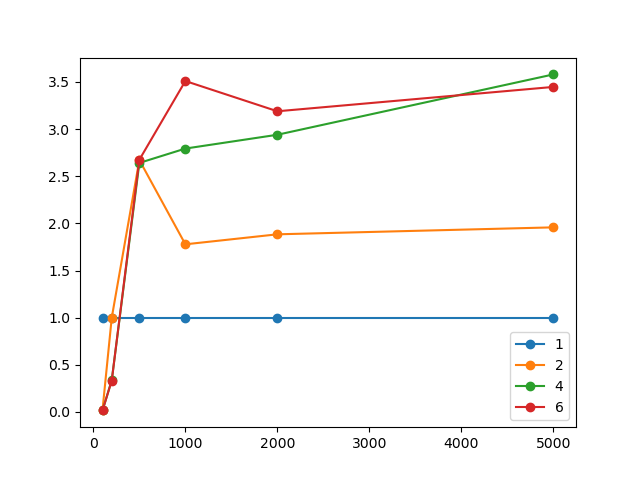

# Решение СЛАУ методом Якоби с помощью MPI

### Окружение

* MSMPI/MPI - протестировано на MSMPI, однако Cmake должен и для других MPI работать
* python(v. 3.6.\*, 3.7.\*)
  * пакеты для python устанавливаются командой `pip install -r requirements.txt`
* cmake (3.15+)
* gcc

### Задача
СЛАУ в задаче
представлена в матричной форме как `A[n×n] × x[n×1] = b[n×1]`. Даны матрицы A и b, 
необходимо найти x с заданной точностью.

Метод Якоби — это итерационный метод решения СЛАУ.
На каждой итерации находятся новые значения вектора x исходя из значений элементов
матриц A и b и значений вектора x, найденных на предыдущем шаге.

Достаточное условие сходимости метода Якоби: `∥B∥ < 1`. Условие окончания алгоритма
`Ax - b < eps`. Однако, при `∥B∥ < 0.5` условие окончания итераций
принимает вид: `max (|x_current - x_old|) < eps`.

### Параллельный алгоритм
1. Каждый из процессов получает параметры задачи: n, eps, A, b, x0. Главный (0-ой) процесс делит
задачу на равные батчи, рассылает информацию о рамере и сдвиге батча всем процессам.
2. На каждой итерации каждый из процессов вычисляет свою часть вектора x. Затем
он рассылает данную часть всем остальным процессам (синхронизация). После
выполнения данного шага все процессы будут иметь новую версию вектора x.
3. Итерирование завершается при достижении условия окончания (достижения точности, превышения лимита итераций).

### Результаты измерений

### Вывод
На исследованных размерах СЛАУ паралельный алгоритм не даёт выигрыша. Возможно, это связано с качеством работы системы с процессором
в ОС Windows.
