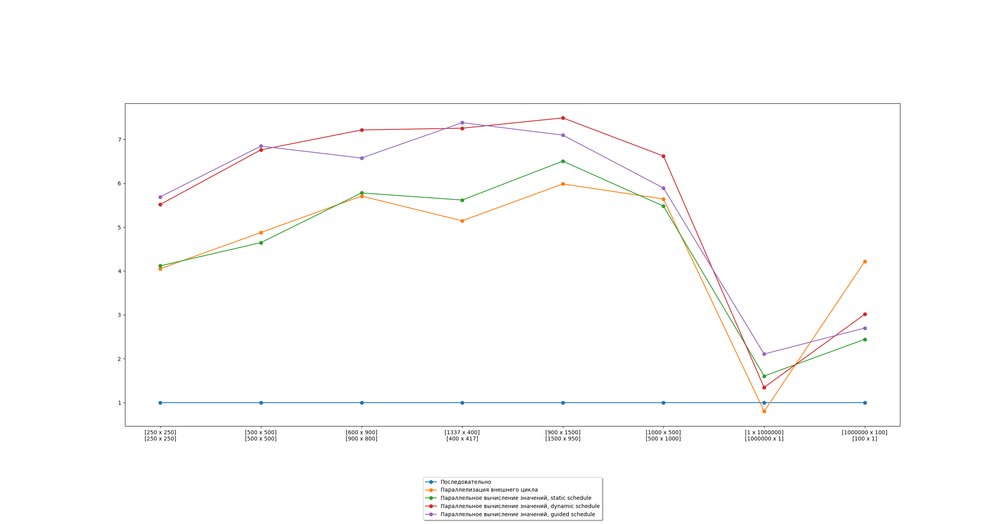

# Параллельное умножение матриц с помощью OpenMP

### Окружение

* python(v. 3.6.\*, 3.7.\*)
  * пакеты для python устанавливаются командой `pip install -r requirements.txt`
* cmake (3.15+)
* gcc

### Задача
Выполнить умножение матриц: `A[a, b] * B[b, c] = C[a, c]`

В ходе экспериментов будем использовать различные значения a, b, c

### Последовательное решение
Последовательное решение представляет собой два вложенных цикла for, вычисляющие
каждый из элементов матрицы C. Вычисление элемента матрицы C - это цикл, вычисляющий
сумму произведений соответствующих элементов матриц A и B. 

### Параллельные решения

##### Строка-задача
Параллелизация внешнего цикла for последовательного решения. Таким образом каждый поток будет получать в качестве
задачи строку матрицы. Таким образом, если строк будет мало, то данное решение не принесет выигрыша в производительности.
А если строка одна, то практически не будет отличаться от последовательного алгоритма.

##### Элемент-задача
Задачей становится вычисление значения элемента матрицы C. Это увеличивает общее кол-во задач, но потенциально позволит более 
эффективно распределять задачи между процессами. Для контроля над способам распределения задач по потокам в OpenMP существует
scheduling.

Типы распределения задач:
* static - поровну
* dynamic - батчами задач фиксированного размера
* guided - батчами задач меняющегося размера

Режимы dynamic и guided позволяют балансировать нагрузку эффективней и эффективнее
утилизировать процессоры, чаще всего являясь наиболее эффективными оказываются режимы,
однако они проигрывают static в ситуациях, когда время на выполнение каждой задачи одинаково, таким образом распределение
задач по итогу совпадет со static. Поскольку static scheduling не привносит дополнительных расходов на 
распределение батчей по потокам в режиме реального времени, static окажется быстрее.

### График ускорений
На графике показаны ускорения вычисления задачи для различных параллельных
реализаций относительно последовательного решения. 
Можно заметить, что наиболее эффективными методами оказались dynamic и guided способы распределения задач, так как 
несмотря на в общем одинаковое кол-во операций на для каждой задачи, их скорость все же отличается.
Также стоит заметить ожидаемое падение эффективности в ситуации с 1 строкой и алгоритмом строка-задача

### Вывод
Наиболее эффективными оказались методы с guided и dynamic распределением задач, так как они позволяют более гибко
распределять задания между потоками. На 8 потоках удалось достичь ускорения в более чем 7 раз
