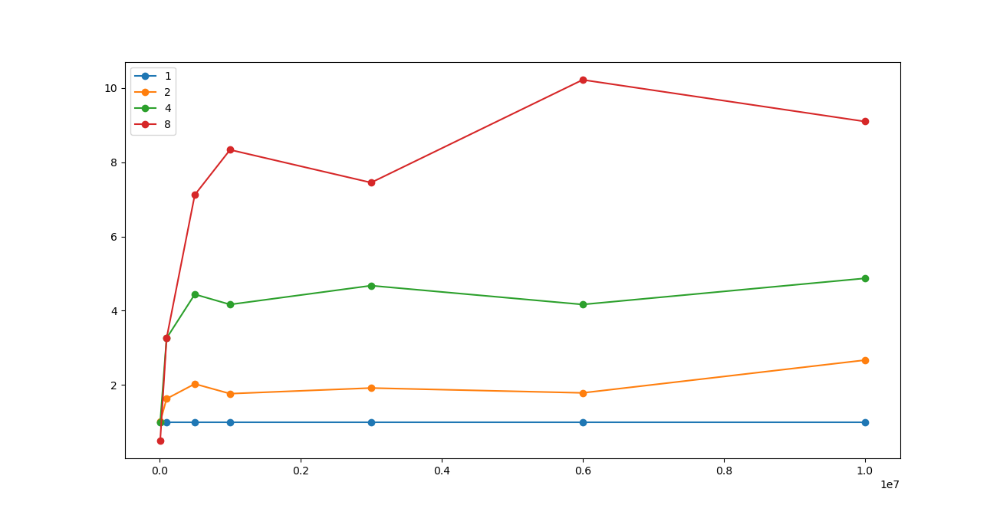
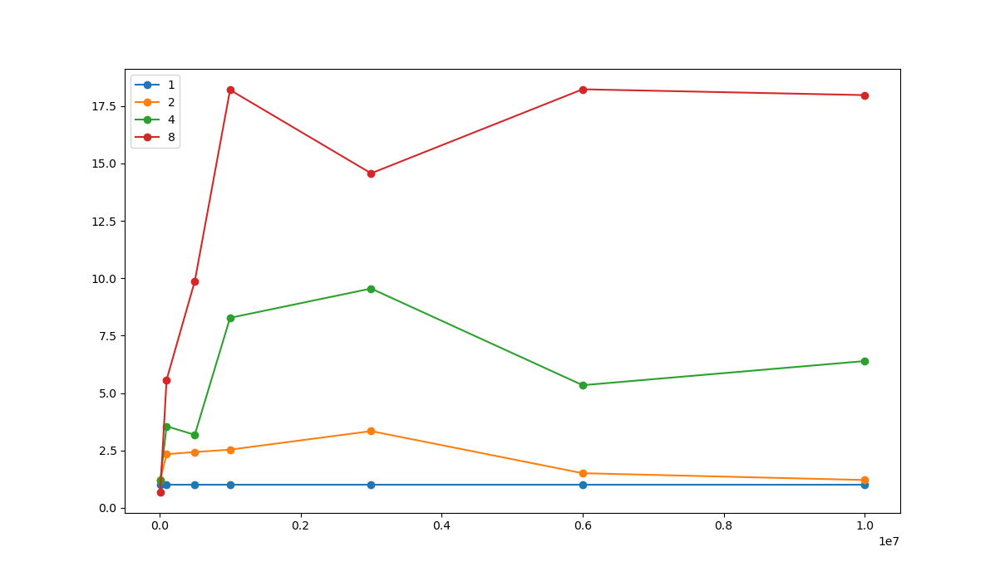
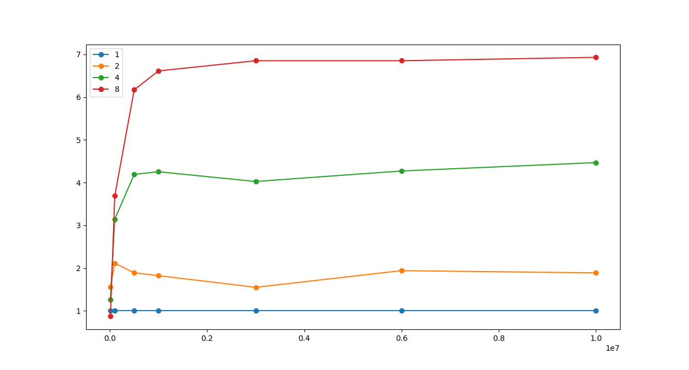

# Parallel Quicksort с помощью MPI
### Окружение

* MSMPI/MPI - протестировано на MSMPI, однако Cmake должен и для других MPI работать
* python(v. 3.6.\*, 3.7.\*)
  * пакеты для python устанавливаются командой `pip install -r requirements.txt`
* cmake (3.15+)
* gcc

## Алгоритм quicksort

* Среди всех процессов выбирается главный. Главный
процесс кроме непосредственных вычислений будет также управлять остальными
процессами.
* В ходе алгоритма процессы объединяются в группы.
В каждой группе выбирается один главный-процесс. Группа имеет чётное количество
процессов, которые будут рекурсивно разделены на две половины/подгруппы (левую и
правую). Каждый процесс в группе имеет партнёра — процесс, с которым данный процесс
будет обмениваться частями массива. Процесс из левой половины имеет партнёра в
правой и наоборот. Исходя из этого общее число процессов должно быть степенью
двойки (1, 2, 4...).
* Процессы обмениваются между собой данными. Все операции отправки данных
асинхронные, все операции получения данных синхронные. Каждая пересылка помечена
тегом, соответствующим этапу алгоритма.

1. Главный процесс считывает массив из файла и распределяет между всеми процессами,
разбив на примерно одинаковые части (размер меняется на 1). Все процессы принимают свою часть. Изначально
все процессы находятся в одной общей группе.
1. В каждой из групп master-процесс выбирает опорный элемент (pivot) и сообщает его
всем участникам группы.
1. Каждый процесс выполняет разбиение и получает две части массива:
элементы <= pivot и элементы > pivot. В каждой из групп
процессы-партнёры обмениваются соответствующими частями массивов так, чтобы
в пределах одной группы в процессах левой половины группы все элементы были меньше опорного
элемента, а в правой — больше.
1. Master выполняет перегруппировку, левая и правая половины группы становятся
самостоятельными группами. Алгоритм переходит к шагу 2 и продолжается пока все
группы не будут состоять из одного процесса.
1. Когда в каждой группе остался единственный процесс, он выполняет сортировку
своей части массива стандартной функцией qsort.
1. Главный процесс собирает отсортированные части массива со всех процессов
и объединяет их в один массив в порядке возрастания номеров процессов.

## Измерение времени вычисления

Важная часть алгоритма сортировки - выбор опорного элемента. Чем ближе этот элемент к медиане всего массива, тем быстрее
будет проходить сортировка. Однако вычисление медианы массива процесс слишком долгий, а также подразумевает сортировку массива,
что по факту лишает смысла создание алгоритма как такового.

Были выбраны 3 способа выбора опорного элемента:
1. Первый элемент массива
2. Медиана и первого, последнего и среднего
3. Медиана из подмассива

### Графики ускорения

На графиках показана зависимость ускорения (отношения времени выполнения сортировки,
использующей один процесс, ко времени выполнения сортировки, использующей несколько
процессов) от длины массива для разного количества процессов.

#### Опорный элемент — первый

#### Опорный элемент — медианный из первого, среднего и последнего

#### Опорный элемент — медианный из подмассива
Подмассив размера 100

## Вывод
* Несмотря на то, что алгоритм с опорным первы элементом показал наибольшие цифры ускорения, 
само по себе ускорение оказывается настабильным. Наиболее стабильное ускорение показал алгоритм с медианой подмассива,
хотя самое увеличение скорости было не столь значительным.
* Для использования медианы подмассива необходимо выбрать подмассив такой длины, дабы его выборка и нахождение медианы
не занимали значительное время, но при этом достаточно репрезентативно показывали бы распределение элементов в массиве.
Иными словами, должен сохраняться баланс между временем выполнения, и точность значения медианы относительно массива.
